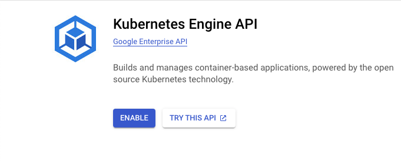

# Gitlab on Google Cloud

This tutorial will deploy Gitlab on Google Cloud using Helm and Kubernetes. 

These instructions mostly use manual steps within the Google Cloud console in
order to help familiarize learners with the Google Cloud ecosystem.
**TO DO:** ~~However, a shell script is included in this repository for automating setup 
and teardown. This script will enable other tutorials (eg: [Juice Shop Deployment](#), [Snyk & Gitlab Bug Bash Tutorial](#), 
[Gitlab with Jenkins](#), [Gitlab with Snyk Broker](#), [Snyk & Gitlab CI Scans](#),
), product demos and reduce costs.~~

These instructions use [Gitlab's official quickstart instructions](https://docs.gitlab.com/charts/quickstart/). 
Additional context is added for Google Cloud steps. If any steps don't work, I 
recommend looking at the corresponding primary source instructions. *Note:* Gitlab's 
quickstart instructions are not meant to sustain a production instance. 

**TO DO:** ~~Contributions to this project are welcome.  Please read the [Contributors Guide]().~~

## Prerequisites
- A Google Cloud account
  - Google offers a [90 day trial period with a $300 credit](https://console.cloud.google.com/freetrial)
- [Install the gcloud CLI](https://cloud.google.com/sdk/docs/install)
- [Install kubectl](https://kubernetes.io/docs/tasks/tools/#kubectl)
- [Install helm](https://helm.sh/docs/intro/install/)
- Own a domain which you can manage DNS records for
  - [Instructions are provided](#register-a-domain-with-cloud-domains) below on how to register a domain with 
   [Cloud Domains](https://cloud.google.com/domains/docs/register-domain), 
   which costs $12/year.

## Google Project and Cluster Setup
1. Login and [Create a project](https://developers.google.com/workspace/guides/create-project)
2. Give the project a name and click "Create"
   
3. After navigating to the new project, click the top left hamburger menu and 
select Kubernetes Engine
   
4. Click the blue Enable button for the Kubernetes API
   
5. Navigate to the Kubernetes clusters and create a cluster
   
6. Select to configure a standard cluster
   
7. Give the cluster a name and select the region. It's *_important_* to select a
region that matches across this tutorial.
   
8. In the left menu click the "default-pool" drop down and change the number
of nodes to 1. This is not a normal setup and only meant to save costs. [Read
more about Kubernetes nodes](https://kubernetes.io/docs/concepts/architecture/nodes/) 
to understand a more realistic setup.
   
9. On the left side menu, select the Nodes option under "default-pool." Then
configure the cluster to use a machine with at lest 8 vCPUs and 30 GB of memory,
following the [Gitlab requirements](https://docs.gitlab.com/charts/quickstart/#create-a-kubernetes-cluster).
   
10. Once configuration is complete, click the Create button at the bottom. 
Cluster setup will take a minute. Once complete, you should have a green
checkmark under your cluster status and a green notification highlight.
    

## Setup kubectl - [Google Instructions](https://cloud.google.com/kubernetes-engine/docs/how-to/cluster-access-for-kubectl#overview)
1. Set the default project for your `gcloud` CLI
```
gcloud config set project gitlab-tutorial-378620
```
2. Set the kubectl default zone with the zone you indicated for your cluster
   1. Confirm GKE auth plugin is installed and if not, install it:
    ```
    gcloud components install gke-gcloud-auth-plugin
    ```
   2. Create an entry in `kubconfig` by running the following from your
   terminal, making sure to indicate your cluster name 
    ```
    gcloud container clusters get-credentials gitlab-tutorial-cluster --internal-ip
    ```
   2. Then setup the default cluster with the following terminal command, again
   making sure to indicate your cluster name and region:
    ```
    gcloud container clusters get-credentials gitlab-tutorial-cluster \
         --region=us-west4-b
    ```
## Setup helm 
1. Confirm a helm version 3 or above is installed: `helm version`
2. Add the gitlab helm chart
```
helm repo add gitlab https://charts.gitlab.io/
```

## Install Gitlab
1. After confirming:
   1. you have the right `kubectl` defaults `gcloud`
   2. the cluster is setup successfully
2. Install the Gitlab helm chart
```
helm install gitlab gitlab/gitlab \
--set global.hosts.domain=owenpickford.com \
--set certmanager-issuer.email=owen.pickford@gmail.com
```
3. This will take a little time but you should receive a success message in
your terminal. After this, you can:
   1. Connect to the cluster
      
   2. navigate to the cluster workloads dashbaord
      
4. Confirm if you should have green status bars for your Gitlab services, though this may
take a little time. You can proceed to the next step before this is complete.
   
5. From your terminal, [get the IP address](https://docs.gitlab.com/charts/quickstart/#retrieve-the-ip-address) of your Gitlab services
```
kubectl get ingress -lrelease=gitlab
```

6. After getting the Gitlab application IP address, you'll need to add it as 
an `A` record with your registered domain. An example, setup is shown for 
Google's "Cloud DNS" below: "Registering a Domain and Creating an A record in
Google Cloud"
7. Navigate to your domain with the "gitlab" subdomain prefix, eg: 
gitlab.owenpickford.com and confirm the page loads. It may take a minute for 
the domain information to propagate. You may also initially see an SSL error 
if you've already setup and deleted Gitlab on the same domain previously. If 
you still can't navigate to your gitlab login page after 5 minutes, see the
troubleshooting section.

8. You can login as the `root` Gitlab admin user by retrieving the password 
with:
```
kubectl get secret gitlab-gitlab-initial-root-password -ojsonpath='{.data.password}' | base64 --decode ; echo
```


## Register a domain with Cloud Domains
1. Search for, "Cloud DNS," navigate to the service and enable the API
   
2. Select "Cloud Domains" from the left side menu. Search for the domain you
want to use and register it and go through the steps to register it. I 
recommend setting up privacy.
   
3. If you just registered a new domain, it will prompt you to setup a zone. 
Navigate to that zone and and click on the zone name to see the configuration. 
4. From the configuration page, click "Add Standard" to setup an A record. 
Indicate a wildcard (*) record and input the IP addresses previously gathered from Gitlab. You can also change the TTL
to one minute so the record updates sooner.
   
5. Navigate to your domain with the "gitlab" subdomain prefix, eg: 
gitlab.owenpickford.com and confirm the page loads. It may take a minute for
the domain information to propagate. You may also initially see an SSL error 
if you've already setup and deleted Gitlab on the same domain previously. If 
you still can't navigate to your gitlab login page after 5 minutes, see the 
troubleshooting section.
   


## Recommended Next Steps
1. Delete the project entirely and spin it up again with the `gitlab_setup.sh` script
2. If you're planning to keep Gitlab running
   1. delete the root user password
   2. keep in mind the costs (likely $10 - $40 a day)
3. Continue to the next tutorials
   1. Put Gitlab on a private network and access it with a deployed broker
   2. Setup Gitlab runners and deploy Juice Shop


## Troubleshooting
### Gitlab isn't accessible
Potential causes
1. Gitlab couldn't start 
2. SSL was unsuccessful 

3. Investigate:
   1. 502: Gitlab startup or installation failure
      1. Mostly likely Gitlab's NGINX server did not start successfully, perhaps
      because the cluster did not have enough resources. Trying using the 
      `setup_gitlab.sh` script to delete everything end start over.
   2. Connection timeout: Misconfigured DNS
      1. Try `dig your.domain.com` and confirm if the IP matches the one you 
      configured in the step to setup an A record in Cloud DNS. If not, the
      domain DNS is not configured correctly. Is your domain owned in the same
      project?
   3. Insecure site: Misconfigured SSL
2. Does the static IP need to be on the attached to a wildcard subdomain?

## Additional Resources
- [Cloud Native Gitlab Helm Chart](https://gitlab.com/gitlab-org/charts/gitlab/-/tree/master/)
- [Gitlab test install instructions](https://docs.gitlab.com/charts/quickstart/index.html)
- [Gitlab managed bootstrap script](https://gitlab.com/gitlab-org/charts/gitlab/blob/master/scripts/gke_bootstrap_script.sh)